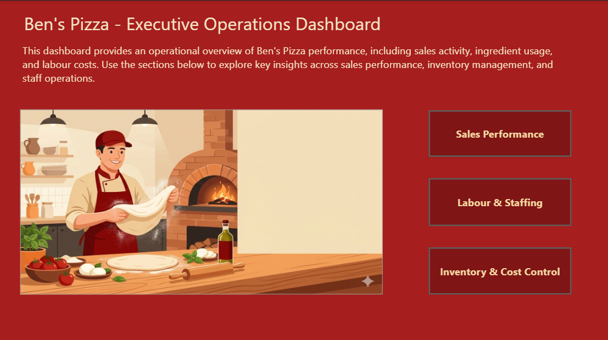

# Restaurant Operations Performance Analysis

## Project Overview

This project analyzes operational performance for a restaurant business using **SQL as the primary analytical tool** and **Power BI for executive visualization**.

The objective of this analysis is to provide visibility into key operational areas including:

- Sales performance
- Product demand patterns
- Ingredient consumption and production costs
- Inventory levels
- Labor utilization and staffing costs

The analysis consolidates multiple operational datasets to support **data-driven decision-making for restaurant management**.

All **data cleaning, transformation, aggregation, and metric calculations were performed using SQL** before importing the final analytical tables into Power BI for dashboard visualization.

---

# Business Problem

Restaurant operations often rely on fragmented data sources across orders, recipes, inventory, and staffing.

Without a centralized analytical view, management teams struggle to answer key operational questions such as:

- Which products generate the most revenue?
- When does peak demand occur?
- Which ingredients drive the highest production costs?
- How efficiently is inventory being utilized?
- How are labor hours and costs distributed across staff members?

This project addresses these challenges by creating a **centralized operational analytics dashboard** that integrates sales, inventory, and workforce data.

---

# Analytical Approach

The analysis followed four main stages.

## 1. Data Preparation (SQL)

All data preparation and transformation steps were performed using **SQL Server**.

Key tasks included:

- Cleaning raw transactional datasets
- Creating relational joins across operational tables
- Aggregating sales and order data
- Calculating ingredient usage per order
- Computing production cost per menu item
- Calculating inventory consumption and remaining stock
- Aggregating labor hours and staff costs

SQL views and queries were used to create analytical tables that feed the final dashboard.

Example analysis included:

- Sales aggregation by product and hour
- Ingredient consumption per order
- Cost-per-pizza calculations
- Inventory remaining calculations
- Staff hours and labor cost analysis

---

# Tools Used

Primary Tools:

- **SQL Server** — data cleaning, transformation, and analysis
- **Power BI** — dashboard visualization and reporting

Technical Concepts Applied:

- SQL joins
- aggregation queries
- cost calculations
- operational metrics
- relational data modeling
- business intelligence dashboards

---

# Dashboard Structure

The final dashboard was designed for operational stakeholders and organized into three main analytical sections.

---

# Sales Performance Analysis

This section analyzes revenue generation and customer demand patterns.

Metrics included:

- Total Orders
- Total Sales
- Items Sold
- Average Order Value

Additional analysis includes:

- Top selling menu items
- Revenue distribution by menu category
- Sales patterns by hour of day
- Geographic distribution of delivery orders

### Sales Dashboard

---

# Inventory and Cost Control

This section focuses on production costs and ingredient usage.

Analysis includes:

- Total ingredient cost
- Ingredient consumption by item
- Production cost per pizza
- Remaining inventory by ingredient

This analysis allows management to identify **cost drivers and inventory risks**.

### Inventory Dashboard

---

# Labor and Staffing Analysis

This section evaluates workforce utilization and labor cost distribution.

Key metrics include:

- Total staff hours
- Total labor cost
- Hours worked per employee
- Staff shift schedules
- Labor cost per employee

This information helps identify opportunities for **staffing optimization and cost management**.

### Labor Dashboard

---

# Landing Page

The landing page provides a high-level introduction and navigation to the different analytical sections.

---

# Key Insights

Several operational insights emerged from the analysis.

**Demand Patterns**

Sales activity peaks during evening hours, indicating that staffing levels should align with dinner service demand.

**Product Performance**

A small number of menu items generate the majority of revenue, suggesting opportunities for menu optimization.

**Cost Drivers**

Certain ingredients contribute disproportionately to production costs and should be monitored closely for cost control.

**Inventory Monitoring**

Inventory tracking allows management to identify ingredients approaching critical stock levels.

**Labor Efficiency**

Labor cost distribution varies significantly between employees, highlighting opportunities to improve scheduling efficiency.

---

# Repository Structure
restaurant-operations-analytics
│
├── README.md
│
├── sql
│ └── operational_queries.sql
│
├── dashboard
│ └── restaurant_operations_dashboard.pbix
│
├── images
│ ├── landing_page.png
│ ├── sales_dashboard.png
│ ├── inventory_dashboard.png
│ └── labor_dashboard.png

---

# Dataset

The dataset used for this project is **not publicly available** and therefore is not included in this repository.

The project focuses on demonstrating **SQL-based operational analytics and dashboard development skills** rather than distributing the underlying data.

---

# Author

Juan Pablo Briceno Ramos  
Business and Data Analyst  
Toronto, Canada
