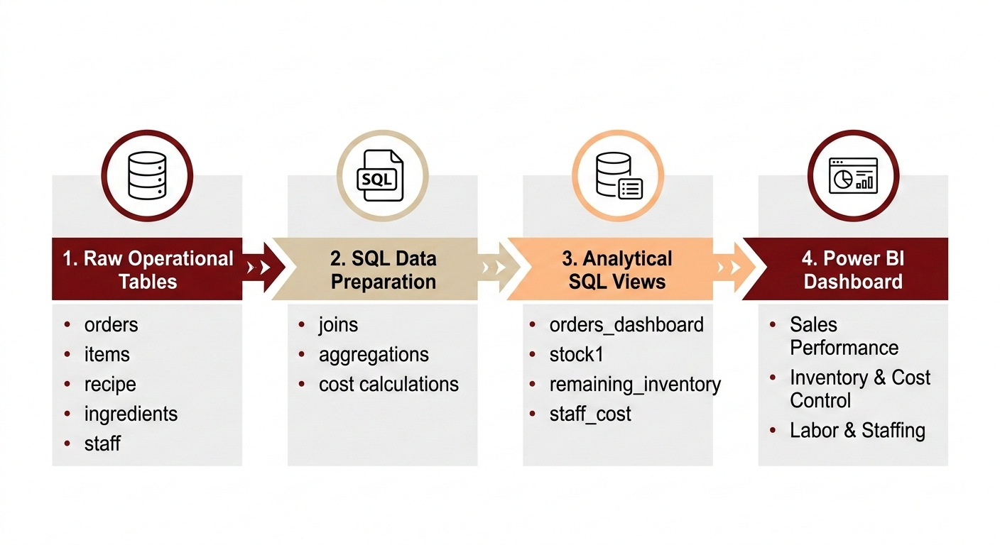
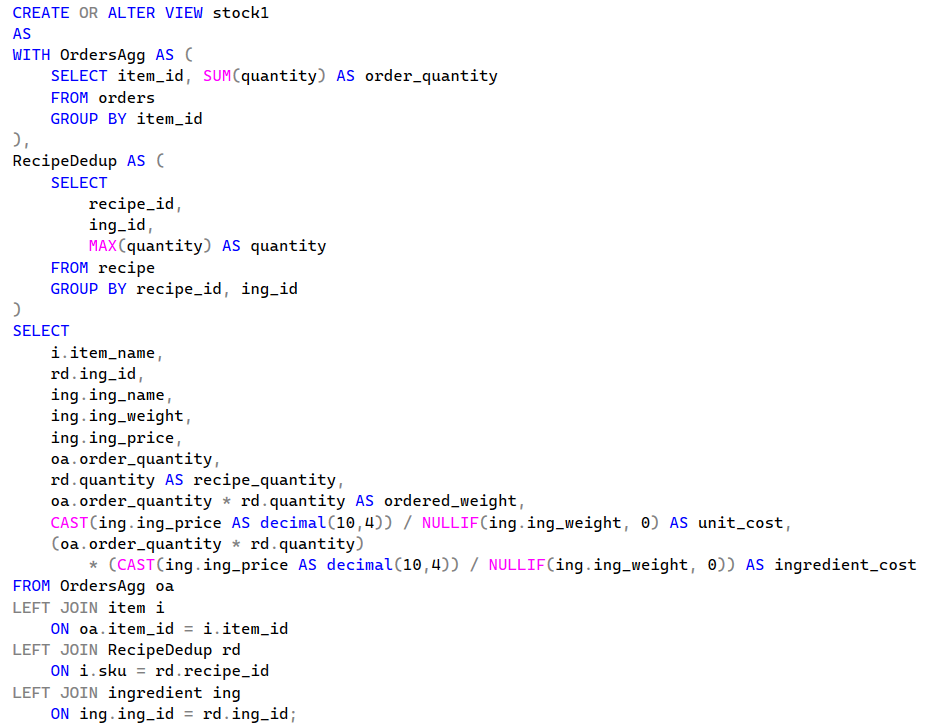
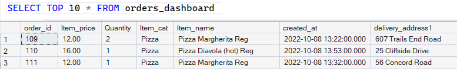
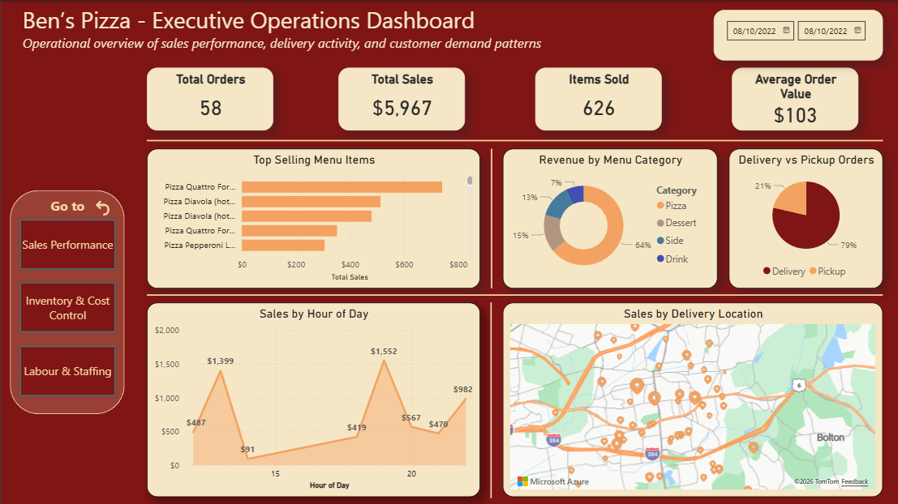
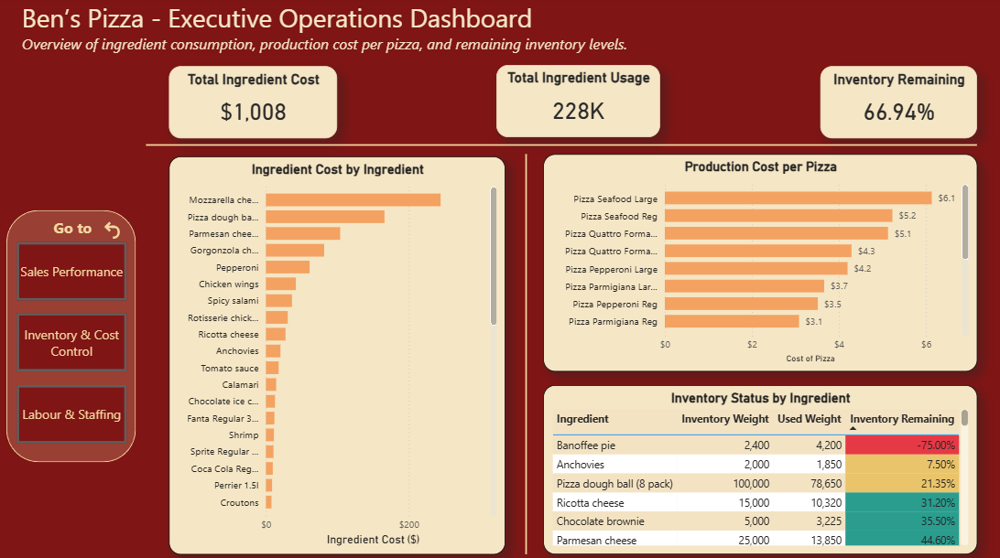
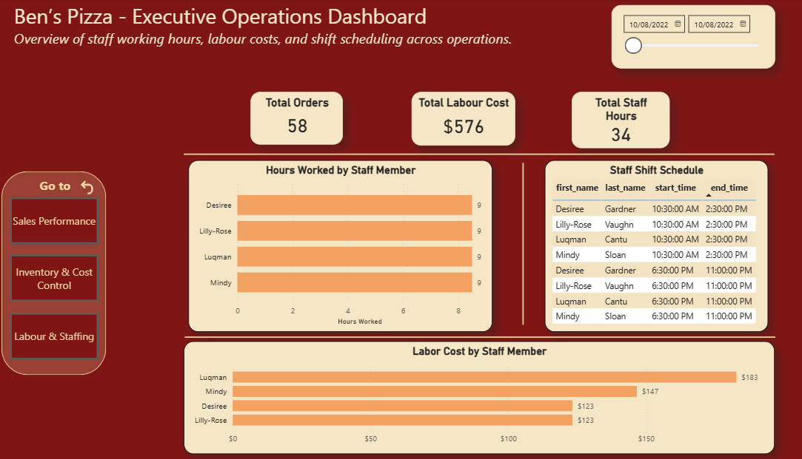

# Restaurant Operations Performance Analysis

## Project Overview

This project analyzes operational performance for a restaurant business using **SQL as the primary analytical tool** and **Power BI for executive visualization**.

The objective of this analysis is to provide visibility into key operational areas including:

- Sales performance
- Product demand patterns
- Ingredient consumption and production costs
- Inventory levels
- Labor utilization and staffing costs

The analysis consolidates multiple operational datasets to support **data-driven decision-making for restaurant management**.

All **data cleaning, transformation, aggregation, and metric calculations were performed using SQL Server** before importing the final analytical tables into Power BI for dashboard visualization.

---

# Data Pipeline Architecture

The analytical workflow follows a **SQL-first architecture**, where raw operational data is transformed using SQL before being visualized in Power BI.



Pipeline flow:

Raw Operational Tables  
↓  
SQL Data Preparation  
↓  
Analytical SQL Views  
↓  
Power BI Dashboard

---

# Business Problem

Restaurant operations often rely on fragmented data sources across orders, recipes, inventory, and staffing.

Without a centralized analytical view, management teams struggle to answer key operational questions such as:

- Which products generate the most revenue?
- When does peak demand occur?
- Which ingredients drive the highest production costs?
- How efficiently is inventory being utilized?
- How are labor hours and costs distributed across staff members?

This project addresses these challenges by creating a **centralized operational analytics solution** integrating sales, inventory, and workforce data.

---

# Data Preparation and SQL Modeling

All transformations and calculations were performed in **SQL Server**.

Key tasks included:

- Joining operational tables
- Aggregating transactional order data
- Calculating ingredient usage per product
- Computing production cost per menu item
- Monitoring remaining inventory
- Calculating staff labor hours and costs

SQL views were created to generate analytical datasets used in the final dashboard.

### Example SQL Logic



---

# Example SQL Output

Example output from one of the analytical views used for reporting.



---

# Analytical SQL Views Created

The following SQL views power the dashboard:

### orders_dashboard
Centralized sales dataset including:

- Order ID
- Item price
- Quantity
- Category
- Item name
- Order timestamp
- Delivery location

### stock1
Calculates ingredient consumption per product order.

Includes:

- ingredient usage
- unit ingredient cost
- production cost per order

### remaining_inventory
Tracks remaining ingredient inventory after production.

Includes:

- total ingredient weight
- consumed ingredient weight
- remaining stock

### staff_cost
Calculates labor hours and staff cost.

Includes:

- shift duration
- staff hourly rate
- labor cost per shift

---

# Tools Used

Primary Tools:

- SQL Server — data cleaning, transformation, analysis
- Power BI — dashboard visualization

Technical Concepts Applied:

- SQL joins
- aggregation queries
- cost calculations
- operational metrics
- relational data modeling
- business intelligence dashboards

---

# Dashboard Structure

The final Power BI dashboard was designed for operational decision-making and organized into three main sections.

---

# Sales Performance Analysis

Analyzes revenue generation and customer demand.

Key metrics:

- Total Orders
- Total Sales
- Items Sold
- Average Order Value

Additional analysis includes:

- Top selling items
- Revenue by category
- Sales by hour
- Orders by delivery location



---

# Inventory and Cost Control

Focuses on ingredient consumption and cost drivers.

Analysis includes:

- Ingredient consumption
- Production cost per pizza
- Inventory remaining
- Ingredient cost contribution



---

# Labor and Staffing Analysis

Evaluates workforce utilization and labor costs.

Key metrics:

- Total staff hours
- Total labor cost
- Hours worked per employee
- Shift schedules



---

# Key Insights

Several operational insights emerged from the analysis.

### Demand Patterns

Sales peak during evening hours, suggesting staffing should align with dinner demand.

### Product Performance

A small group of menu items generates most revenue, indicating opportunities for menu optimization.

### Cost Drivers

Certain ingredients contribute disproportionately to production costs.

### Inventory Monitoring

Inventory tracking allows management to detect ingredients approaching critical stock levels.

### Labor Efficiency

Labor cost distribution varies significantly across employees, highlighting scheduling optimization opportunities.

---

# Repository Structure

```
restaurant-operations-analytics

README.md

sql
 operational_queries.sql

dashboard
 restaurant_operations_dashboard.pbix

images
 data_pipeline.png
 sql_code_logic.png
 sql_sales_view_output.png
 landing_page.png
 sales_dashboard.png
 inventory_dashboard.png
 labor_dashboard.png
```

---

# Dataset

The dataset used for this project is **not publicly available** and therefore is not included in this repository.

This repository focuses on demonstrating **SQL-based operational analytics and dashboard development skills**.

---

# Author

Juan Pablo Briceño Ramos  
Business & Data Analyst  
Toronto, Canada
